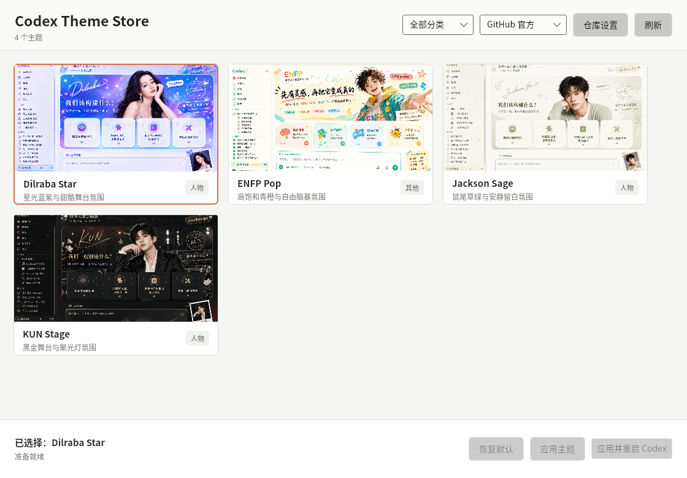

# Codex-Skin

[简体中文](README.md) | [English](README.en.md)

[](https://github.com/lixiaobaivv/Codex-Skin/actions/workflows/ci.yml)
[](https://github.com/lixiaobaivv/Codex-Skin/actions/workflows/build.yml)

Codex-Skin is a desktop theme client for Codex on Windows and macOS. It provides a visual theme browser, safe switching and rollback, and signed one-click imports from [Codex-Skin-Store](https://lixiaobaivv.github.io/Codex-Skin-Store/).

> Codex-Skin is a community project, not an OpenAI or official Codex product. It does not modify the signed Codex installation or read API keys, projects, tasks, or conversations.



## Download

Open the [latest release](https://github.com/lixiaobaivv/Codex-Skin/releases/latest) and choose:

| Platform | Recommended file | Notes |
| --- | --- | --- |
| Windows x64 | `Codex-Skin-Setup-win-x64.exe` | Complete installer with web import registration |
| macOS Apple Silicon | `Codex-Skin-osx-arm64.pkg` | M-series Macs |
| macOS Intel | `Codex-Skin-osx-x64.pkg` | Intel Macs |

Windows is distributed only through Setup; portable EXE and ZIP downloads are not published.

The clients are built with Tauri 2 and Rust. Windows uses the system WebView2 runtime and macOS uses WKWebView, so no separate application runtime is required. Windows and Apple commercial signing are not currently available, so SmartScreen or Gatekeeper may request explicit approval.

## Use On Windows

1. Install `Codex-Skin-Setup-win-x64.exe`.
2. Open Codex-Skin and wait for the catalog refresh.
3. Select **All** or a theme category from the horizontal filter at the upper left, then choose a theme.
4. Choose **Apply and restart Codex**.
5. Choose **Restore default** to remove the theme.

Setup registers `dreamskin://` and `.dreamskin` for the current user and removes only its own associations during uninstall.

## Use On macOS

1. Install the PKG matching your Mac processor.
2. Open `Codex-Skin.app` from Applications.
3. If Gatekeeper blocks the unsigned package, verify its SHA-256 first, then use **System Settings → Privacy & Security → Open Anyway**.
4. Select a theme and choose **Apply and restart Codex**.

The PKG declares the `dreamskin://` URL scheme and `.dreamskin` document type. Open Codex-Skin once after installation so LaunchServices can complete registration. macOS packages are currently unsigned and not notarized. CI builds both Apple Silicon and Intel PKGs; final releases should still be smoke-tested on matching physical hardware for system activation and launch behavior.

## One-Click Web Import

Open [Codex-Skin-Store](https://lixiaobaivv.github.io/Codex-Skin-Store/), select a published theme, and choose one-click import.

The client:

1. shows the source host, theme hint, version, and exact size;
2. asks before downloading;
3. shows download progress and retries the selected GitHub transport and built-in mirrors when needed;
4. verifies package SHA-256, Ed25519 signature, manifest, and images;
5. installs atomically;
6. asks separately before restarting Codex and applying the theme.

A web click never silently installs or applies a theme. Local `.dreamskin` files can also be opened with the installed app.

If Codex-Skin is already running, web and file activations are forwarded to that window and bring it to the front. A new window is created only when no client instance is running.

Verified imports remain in the local theme browser after Codex-Skin restarts. When several versions of the same theme are installed, the newest semantic version is selected.

## Catalog And Mirrors

The desktop catalog is fixed to the public [lixiaobaivv/Codex-Skin-Store](https://github.com/lixiaobaivv/Codex-Skin-Store) repository. Users can select direct GitHub, GH Proxy, or GHFast transport, but cannot redirect the client to an unreviewed repository.

Installers no longer duplicate the online themes. The first launch requires a catalog sync; later launches retain the last validated cache. Sync starts with the last successful transport, automatically falls back across GitHub, GH Proxy, and GHFast, and saves the transport that actually succeeded. Updates are fully validated in a temporary directory before that cache is replaced.

The web signed-package catalog and desktop theme catalog are separate contracts. Both are declarative and reject JavaScript, HTML, CSS, SVG, executable payloads, traversal, and unlisted assets.

## Theme Scope

Themes may change backgrounds, fixed sidebar appearance, masthead, logo, hero copy, four prompt cards, message bubbles, composer appearance, and an optional pet image.

Themes cannot replace project, task, progress, conversation, or account data. Prompt cards only insert their configured prompt into the real Codex composer.

## Troubleshooting

**The theme did not appear:** use **Apply and restart Codex**. Codex-Skin only connects to the loopback CDP endpoint at `127.0.0.1:9229`.

**Catalog refresh failed:** refresh automatically tries GitHub, GH Proxy, and GHFast. Existing themes remain available if every transport fails.

**One-click import did nothing:** repair the Windows Setup registration, or confirm that macOS uses the PKG with URL handler support and has been opened once.

**Codex became slow after applying a theme:** restore the default theme and reapply with the latest client. The current runtime ignores streaming-message internals, avoids full-page mutation scans, and removes expensive full-surface blur effects.

## Security

- The signed Codex application is not modified.
- CDP is loopback-only.
- Catalog files and images are treated as untrusted input.
- DreamSkin packages have strict size, path, file count, media, and pixel limits.
- SHA-256 protects transfer integrity; Ed25519 verifies publisher trust.
- Installation and application always require separate confirmation.

See [cross-platform architecture](docs/cross-platform-architecture.md), [desktop catalog v1](docs/theme-repository-v1.md), and [DreamSkin compatibility](docs/dreamskin-compatibility.md) for technical boundaries.

## Architecture

Codex-Skin is built with Tauri 2, Rust, and TypeScript/Vite. Its architecture separates the interface, application bridge, domain core, runtime integration, and release tooling:

- **Interface** (`src/`) provides catalog browsing, category filters, previews, download confirmation, and application status inside the system WebView.
- **Application bridge** (`src-tauri/src/lib.rs`) connects the interface to Rust through Tauri commands and events, and handles single-instance, deep-link, and local-file activation.
- **Domain core** (`repository.rs`, `catalog.rs`, `compiler.rs`, `dreamskin.rs`, and `protocol.rs`) owns catalog synchronization, schema and asset validation, semantic-version selection, CSS/JavaScript compilation, signature verification, and safe downloads.
- **Runtime integration** (`cdp.rs` and `platform.rs`) discovers and launches Codex, connects only to loopback CDP targets, and performs persistent injection, verification, and rollback.
- **State and release tooling** (`paths.rs`, `authoring.rs`, `src-tauri/src/bin/`, and `installer/`) provides atomic state persistence, catalog authoring, signed-package diagnostics, and Windows/macOS packaging.

The desktop catalog flow is: download from a fixed official source into a temporary directory → validate the catalog, manifests, and images → atomically replace the local cache → compile the declarative theme → apply it to Codex through loopback CDP. Web and local `.dreamskin` imports use a separate path that verifies size, SHA-256, Ed25519/RFC8785 signatures, ZIP paths, and decoded image content before installation.

Windows and macOS share the interface and domain logic. Platform-specific code is limited to Codex discovery, process launch, window activation, and installer associations, keeping theme rules and security validation independent of the operating system.

## Development And Verification

Development requires Node.js 22, stable Rust, and the platform prerequisites for Tauri. Windows requires MSVC Build Tools and WebView2; macOS requires Xcode Command Line Tools.

```bash
npm ci
npm run tauri -- dev
```

Run the same checks enforced by CI before submitting changes:

```bash
npm run build
node --test tests/dreamskin-catalog-fixtures.test.mjs tests/dreamskin-fixture.test.mjs tests/release-contract.test.mjs
cargo fmt --manifest-path src-tauri/Cargo.toml -- --check
cargo clippy --manifest-path src-tauri/Cargo.toml --all-targets --locked -- -D warnings
cargo test --manifest-path src-tauri/Cargo.toml --locked
```

Build an optimized application for the current platform with:

```bash
npm run tauri -- build --no-bundle
```

The [Build and package](https://github.com/lixiaobaivv/Codex-Skin/actions/workflows/build.yml) workflow produces the Windows Setup executable and both macOS PKGs. See [theme authoring](docs/theme-authoring.md) and [signed sample publishing](docs/publish-signed-sample.md) for catalog and package tooling.

## Contributing

Theme submissions belong in the [Codex-Skin-Store submission guide](https://github.com/lixiaobaivv/Codex-Skin-Store/blob/main/docs/theme-submission.md). Client issues belong in [Codex-Skin Issues](https://github.com/lixiaobaivv/Codex-Skin/issues).

End users do not need the development toolchain. Code contributions should pass every command above before submission; theme contributions follow the separate Store repository's schema and review process.
